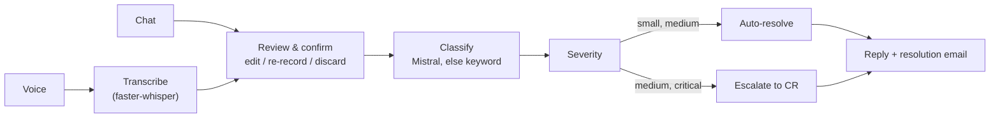
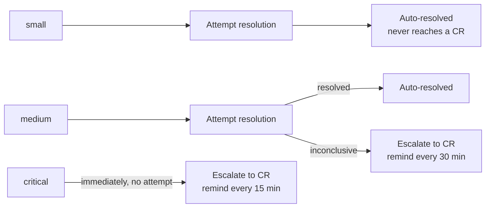
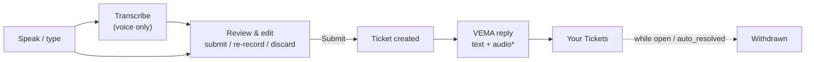
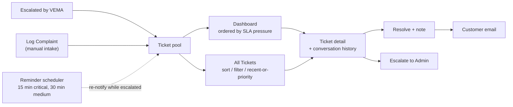
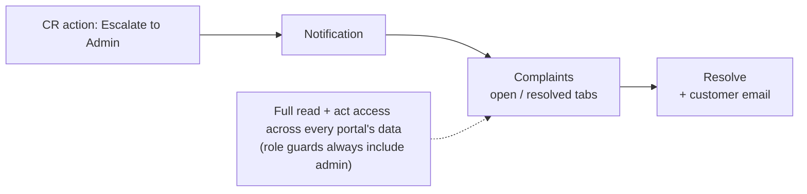

# VEMA_PIPELINE.md

What currently works in the VEMA complaint pipeline (voice + chat intake →
classification → routing → resolution), and how a complaint moves through
each portal. See `VEMA_BACKEND_WIRING.md` for the deeper API/taxonomy notes
this summarises.

## Stack

FastAPI + SQLAlchemy + PostgreSQL. `faster-whisper` (small) for STT,
Kokoro for TTS, Mistral for NLU, APScheduler for the reminder job. The
three integrations are optional — each has an offline fallback (see
[Dev-mode fallbacks](#dev-mode-fallbacks)).

## What's working

### Intake

| Capability | State |
|---|---|
| **Voice complaints** — recorded in-browser, transcribed locally by faster-whisper; customer edits the transcript before it's submitted | ✅ working |
| **Chat complaints** — typed, same review-before-submit step (Submit / Re-record / Discard) | ✅ working |
| **Spoken reply** — VEMA's acknowledgement read back via Kokoro TTS | ⚙️ dev-mode (text-only) |

### Classification & routing

| Capability | State |
|---|---|
| **NLU classification** into 8 categories + subtype + severity — Mistral when `MISTRAL_API_KEY` is set, deterministic keyword classifier otherwise | ✅ working |
| **Three-tier severity** (`small` / `medium` / `critical`) from taxonomy defaults with per-subtype overrides | ✅ working |
| **Auto-resolution attempt** for `small` / `medium`; `critical` skips straight to a representative | ✅ working |

### Representative handling

| Capability | State |
|---|---|
| **Escalation** with a role notification to every Customer Representative | ✅ working |
| **Reminder cadence** while `escalated` — every 15 min (critical) / 30 min (medium), background scheduler ticking each minute | ✅ working |
| **CR dashboard** (tickets ordered by SLA pressure) + **full ticket log** with sort (`recent` / `priority`) and filters | ✅ working |
| **Ticket detail** with the complete conversation + system-event history; **Resolve** (with note) or **Escalate to Admin** | ✅ working |
| **Log a complaint manually** — representative records a walk-in / phone-in on the customer's behalf | ✅ working |

### Customer follow-up

| Capability | State |
|---|---|
| **"Your Tickets"** list with live status for the signed-in customer | ✅ working |
| **Withdraw a complaint** — only while `open` / `auto_resolved`; blocked once a representative is on it | ✅ working |
| **Resolution email** to the customer when a ticket closes | ✅ working (dev-mode delivery: console) |

## The pipeline, end to end



Both channels converge on a customer-confirmed review step — **no ticket
exists until the customer presses Submit**. Classification assigns a
category and severity tier; the tier decides whether VEMA attempts a
resolution or escalates. Every step is written to the ticket's event log
(`complaint_events`).

## Severity routing



Severity comes from taxonomy defaults, with specific subtypes overriding
their category (e.g. `wrongful disconnection` is critical even though its
category default is medium). A `small` ticket is **always** closed by the
system — if the classifier can't produce a confident resolution it still
closes with a generic acknowledgement rather than bothering a
representative.

| Tier | Default categories | Path | Reminder |
|---|---|---|---|
| 🟢 `small` | Billing, Customer Service | Auto-resolved, always | — |
| 🟡 `medium` | Meter, New Connection, Payment & Refund | Try auto-resolve, else escalate | every 30 min |
| 🔴 `critical` | Power Supply, Infrastructure, Fraud/Theft | Escalate immediately | every 15 min |

## Customer Portal

One screen: a voice/chat composer and the customer's own ticket list. The
customer always sees and can edit what will be submitted before a ticket is
created, and can withdraw a ticket while it is still unhandled.



\* audio reply requires Kokoro TTS — currently text-only.

```
POST   /api/complaints/voice/transcribe   # audio → transcript, no ticket
POST   /api/complaints/voice              # confirmed transcript → ticket
POST   /api/complaints/chat               # confirmed text → ticket
GET    /api/complaints/mine
DELETE /api/complaints/{id}               # withdraw — open / auto_resolved only
```

## Customer Representative Portal

Tickets arrive two ways — escalated by VEMA, or logged by the
representative for a walk-in / phone-in. The dashboard surfaces what is
closest to breaching its reminder SLA; the log is the full record.



A representative opens a ticket from either view, reads the full event
history (voice transcript, classification, escalations, prior reminders),
then resolves it with a note — which emails the customer — or escalates it
to Admin. The scheduler keeps re-notifying while a ticket sits `escalated`.

```
GET    /api/complaints?order=recent|priority   # the log
GET    /api/complaints/{id}                     # detail + events
POST   /api/complaints/manual                   # log a walk-in / phone-in
PATCH  /api/complaints/{id}                      # action: resolve | escalate
```

## Admin Portal

Admin is the fall-through for anything a representative can't close, and
has oversight of every ticket. The complaints view is a lighter
open / resolved queue.



Escalating to Admin adds an event to the ticket and notifies every admin;
the ticket itself stays in the same table. Because every role guard
implicitly includes `admin`, an admin can also act on tickets directly
through the same endpoints the representative uses.

## Dev-mode fallbacks

Three integrations are optional and currently running their offline path.
The full ticket lifecycle — classify, route, auto-resolve or escalate,
remind, resolve — runs identically with or without them. Set the keys in
`ai-module/.env` to switch each on.

| Integration | Unset behaviour |
|---|---|
| **Mistral NLU** (`MISTRAL_API_KEY`) | deterministic keyword classifier |
| **Kokoro TTS** (`kokoro` package) | text-only replies |
| **SMTP** (`SMTP_USER` / `SMTP_PASSWORD`) | outbound email printed to the console |
